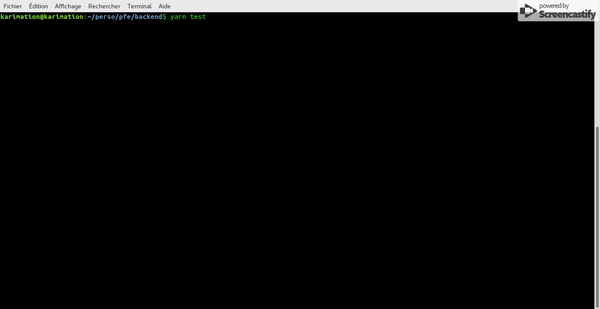

 # SteemEnd

New API for steem blockchain with Javascript.

# Getting Started

Install yarn:

```
npm install -g yarn
```

Install dependencies:

```
yarn
```

Start server:

```
yarn
```

Start server with nodemon (Auto server restart):

```
nodemon
```

Tests:

```
# Run tests written in ES6 
yarn test

# Run test along with code coverage
yarn test:coverage

# Run tests on file change
yarn test:watch

# Run tests enforcing code coverage (configured via .istanbul.yml)
yarn test:check-coverage
```

## Code Coverage
Get code coverage summary on executing yarn test 




# API

## Auth: steemConnect


## Post

### Get User Posts 

### Get New 

### Get Hot 

### Get Trending
